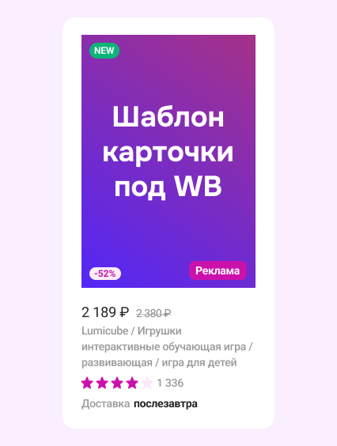

## Product Card (Wildberries-style)

[](https://mistyowl.github.io/wb-card/)
[](LICENSE)


A small, pixel-perfect product card layout inspired by marketplace product cards (similar to Wildberries).  
The markup and styling repeat the original Figma design as closely as possible, including sizes, spacing and typography.

Figma design: [Design Marketplace Card](https://www.figma.com/design/iWr3tTO5cuhMi5W0CMgi3l/Design-Marketplace-Card?node-id=0-1&t=3LVxyA8YvxrGpv7l-1)



### Features

- **Pixel-perfect layout**: card dimensions and spacing match the Figma design.
- **Badges**: "NEW", discount badge, and "Реклама" label.
- **Price block**: current and original price with strike-through.
- **Product info**: name and short description.
- **Rating**: 5-star rating using SVG icons (purple and gray) plus reviews count.
- **Delivery info**: label and delivery date.
- **Centered layout**: the card is centered on the page using Flexbox.

### Tech Stack

- **HTML5** – semantic, minimal markup.
- **CSS3** – modern layout using Flexbox, custom typography and spacing.
- **SVG** – vector icons for rating stars.

### Getting Started

1. Clone the repository:

```bash
git clone https://github.com/your-username/your-repo-name.git
cd your-repo-name
```

2. Open `index.html` directly in the browser (double-click or open via your code editor’s live server).

No build tools or dependencies are required; this is a pure HTML/CSS project.

### Project Structure

- `index.html` – main markup for the product card.
- `style.css` – styles for layout, typography and badges.
- `img/Image.png` – product preview image.
- `img/Star-purple.svg` – active (filled) star icon.
- `img/Star-gray.svg` – inactive (empty) star icon.

---
